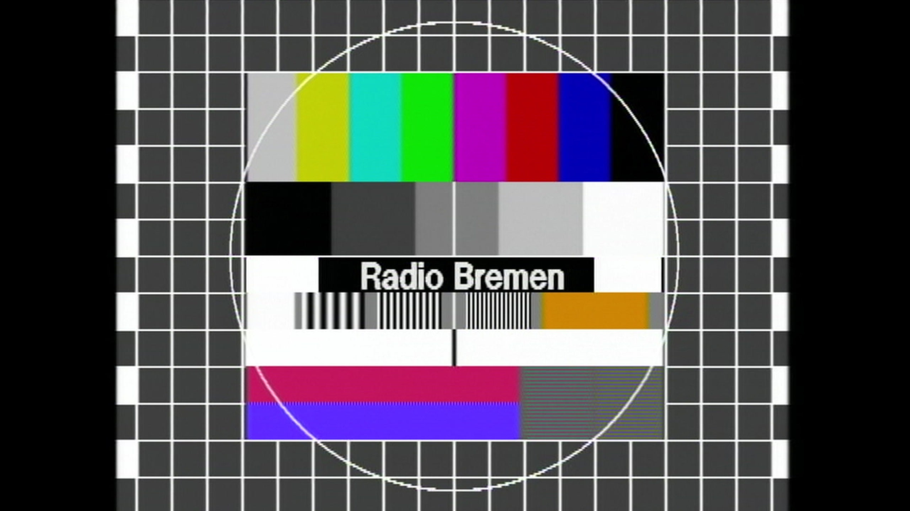

# Overview

Say something here about the project.


# Markdown Syntax
## Figures
Narrow image:
```markdown

```
Medium sized image:
```markdown

```
Wide image:
```markdown

```

Here is an example:




# License

.. include:: ../LICENSE

